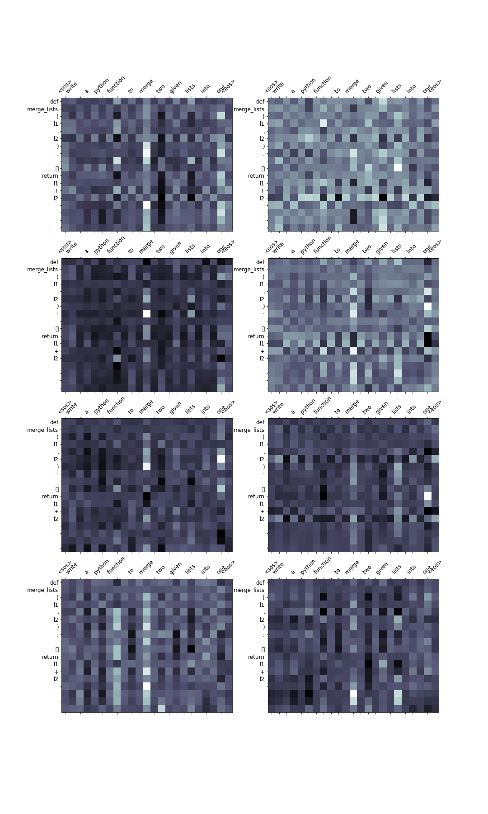

# Capstone Report

### Contents
[1.Data Cleaning](#datacleaning)  
[2.Model Architecture](#architecture)  
[3.Loss Function](#loss)  
[4.Data Preparation](#dataprep)  
[5.Python Code Embedding](#embedding)  
[6.Evaluation Metrics](#metric)  
[7.Outputs](#outputs)  
[8.Attention Graphs](#attention)  
[9.Others](#others)  
[10.References](#references)  


**1.Data Cleaning:**<a name="datacleaning"></a>

The Dataset is a text file with pair's of queue and python code snippet's. Each example is seperated by a new_line character and '#' symbol**(\n#) **.Additionally some sentences start with a space after the '#' symbol and some don't, to remove them the queue is first tokenised and checked for space's in the beginning of the sentence.

**2.Model Architecture:**<a name="architecture"></a>
The detailed explanation of the model architecture is available in the link [here.](https://www.linkedin.com/pulse/understanding-attention-all-you-need-abishek-raju/?trackingId=Qm11qBdpT1%2BWSlACVKycpg%3D%3D) 

**3.Loss Function:**<a name="loss"></a>
The loss function used in this experiment is a combination of CrossEntropyLoss and HingeEmbeddingLoss which have been scaled to 99.5 and 0.05 respectively.
**4.Data Preparation:**<a name="dataprep"></a>
During the training of the model it was found that two similar queue's when passed through the model would give different result even though they mean the same.
Ex:
queue-1:"write a program to add two numbers"

queue-2:"add two numbers"

As an attempt to overcome this problem  a copy of the queue is modified to remove some common words like "write","program","function","to",......Due to this the total examples have doubled and is working as an augmentation technique.This change although improved the result of some queue's not all of them were giving the expected result.

**5.Python Code Embedding:**<a name="embedding"></a>
Python code snippet's are first tokenised using the tokenize library. "INDENT" token is given special care and indent(4 space's) are replaced by "\t". Some snippet's contain irregular number of space's which are rounded off. Each snippet is tokenised and all the tokenised snippet's are appended to a list which is used to train the embedding's. Embedding's are trained using the gensim library Word2Vec for a total of 100 epoch's. All other parameter's of the Word2Vec model are kept default. The Dimension of the Word2Vec embedding's are same as the Dimension of the embedding layer present in the decoder part of the Transformer arhitecture. This is important so that the embedding vector's from Word2Vec can be transformed to the embedding of the decoder in transformer's architecture.

**6.Evaluation Metrics:**<a name="metric"></a>
The Evaluation metric used is BLEU score which after training for 100 epochs is 72.


**7."25"  example output from model**<a name="outputs"></a>


**queue**: 0
*write  a  python  program  to  add  two  numbers*

**snippet**:

```python
num1 = 1.5 
num2 = 6.3 
sum = num1 + num2 
print ( f'Sum: {sum}' ) 
```

**predicted**:

```python
num1 = 1.5 
num2 = 6.3 
sum = num1 + num2 
print ( f'Sum: {sum}' ) 
```
**************************************************

**queue**: 1
*write  a  python  function  to  add  two  user  provided  numbers  and  return  the  sum*

**snippet**:

```python
def add_two_numbers ( num1 , num2 ) : 
	sum = num1 + num2 
return sum 
```

**predicted**:

```python
def add_two_numbers ( num1 , num2 ) : 
	sum = num1 + num2 
return sum 
```
**************************************************

**queue**: 2
*write  a  program  to  find  and  print  the  largest  among  three  numbers*

**snippet**:

```python
num1 = 10 
num2 = 12 
num3 = 14 
if ( num1 >= num2 ) and ( num1 >= num3 ) : 
	largest = num1 
elif ( num2 >= num1 ) and ( num2 >= num3 ) : 
	largest = num2 
else : 
	largest = num3 
print ( f'largest:{largest}' ) 
```

**predicted**:

```python
num1 = 10 
num2 = 12 
num3 = 14 
if ( num1 >= num2 ) and ( num1 >= num3 ) : 
	largest = num1 
elif ( num2 >= num1 ) and ( num2 >= num3 ) : 
	largest = num2 
else : 
	largest = num3 
print ( f'largest:{largest}' ) 
```
**************************************************

**queue**: 3
*write  a  program  to  find  and  print  the  smallest  among  three  numbers*

**snippet**:

```python
num1 = 10 
num2 = 12 
num3 = 14 
if ( num1 <= num2 ) and ( num1 <= num3 ) : 
	smallest = num1 
elif ( num2 <= num1 ) and ( num2 <= num3 ) : 
	smallest = num2 
else : 
	smallest = num3 
print ( f'smallest:{smallest}' ) 
```

**predicted**:

```python
num1 = 10 
num2 = 12 
num3 = 14 
if ( num1 <= num2 ) and ( num1 <= num3 ) : 
	smallest = num1 
elif ( num2 <= num1 ) and ( num2 <= num3 ) : 
	smallest = num2 
else : 
	smallest = num3 
print ( f'smallest:{smallest}' ) 
```
**************************************************

**queue**: 4
*write  a  python  function  to  merge  two  given  lists  into  one*

**snippet**:

```python
def merge_lists ( l1 , l2 ) : 
	return l1 + l2 
```

**predicted**:

```python
def merge_lists ( l1 , l2 ) : 
	return l1 + l2 
```
**************************************************

**queue**: 5
*write  a  program  to  check  whether  a  number  is  prime  or  not*

**snippet**:

```python
num = 337 

if num > 1 : 
	for i in range ( 2 , num // 2 + 1 ) : 
		if ( num % i ) == 0 : 
			print ( num , "is not a prime number" ) 
print ( f"{i} times {num//i} is {num}" ) 
break 
else : 
			print ( f"{num} is a prime number" ) 
break 

else : 
	print ( f"{num} is not a prime number" ) 
```

**predicted**:

```python
num = 407 

if num > 1 : 
	for i in range ( 2 , num // 2 + 1 ) : 
		if ( num % i ) == 0 : 
			print ( num , "is not a prime number" ) 
print ( f"{i} times {num//i} is {num}" ) 
break 
else : 
			print ( f"{num} is a prime number" ) 
break 
else : 
	print ( f"{num} is not a prime number" ) 
```
**************************************************

**queue**: 6
*write  a  python  function  that  prints  the  factors  of  a  given  number*

**snippet**:

```python
def print_factors ( x ) : 
	print ( f"The factors of {x} are:" ) 
for i in range ( 1 , x + 1 ) : 
		if x % i == 0 : 
			print ( i ) 
```

**predicted**:

```python
def print_factors ( x ) : 
	print ( f"The factors of {x} are:" ) 
for i in range ( 1 , x + 1 ) : 
		if ( x % i == 0 ) : 
			print ( i ) 
```
**************************************************

**queue**: 7
*write  a  program  to  find  the  factorial  of  a  number*

**snippet**:

```python
num = 13 
factorial = 1 

if num < 0 : 
	print ( "No factorials for negative numbers!" ) 

elif num == 0 : 
	print ( "The factorial of 0 is 1" ) 

else : 
	for i in range ( 1 , num + 1 ) : 
		factorial = factorial * i 
print ( f"The factorial of {num} is {factorial}" ) 
```

**predicted**:

```python
num = int ( input ( "Enter a number: " ) ) 
factorial = 1 
if num < 0 : 
	print ( "Sorry, factorial does not exist for negative numbers" ) 
elif num == 0 : 
	print ( "The factorial of 0 is 1" ) 
else : 
	for i in range ( 1 , num + 1 ) : 
		factorial = factorial * i 
print ( "The factorial of" , num , "is" , factorial ) 

```
**************************************************

**queue**: 8
*write  a  python  function  to  print  whether  a  number  is  negative ,  positive  or  zero*

**snippet**:

```python
def check_pnz ( num ) : 
	if num > 0 : 
		print ( "Positive number" ) 
elif num == 0 : 
		print ( "Zero" ) 
else : 
		print ( "Negative number" ) 
```

**predicted**:

```python
def check_pnz ( num ) : 
	if num > 0 : 
		print ( "Positive number" ) 
elif num == 0 : 
		print ( "Zero" ) 
else : 
		print ( "Negative number" ) 
```
**************************************************

**queue**: 9
*write  a  program  to  print  the  multiplication  table  of  a  given  number*

**snippet**:

```python
num = 9 
for i in range ( 1 , 11 ) : 
	print ( f"{num} x {i} = {num*i}" ) 
```

**predicted**:

```python
num = 12 
for i in range ( 1 , 11 ) : 
	print ( f"{num} x {i} = {num*i}" ) 
```
**************************************************

**queue**: 10
*write  a  python  function  to  print  powers  of  2 ,  for  given  number  of  terms*

**snippet**:

```python
def two_power ( terms ) : 
	result = list ( map ( lambda x : 2 ** x , range ( terms ) ) ) 

print ( f"The total terms are: {terms}" ) 
for i in range ( terms ) : 
		print ( f"2^{i} = {result[i]}" ) 
```

**predicted**:

```python
def two_power ( terms ) : 
	result = list ( map ( lambda x : 2 ** x , range ( terms ) ) ) 

print ( f"The total terms are: {terms}" ) 
for i in range ( terms ) : 
		print ( f"2^{i} = {result[i]}" ) 

```
**************************************************

**queue**: 11
*write  a  program  to  filter  the  numbers  in  a  list  which  are  divisible  by  a  given  number*

**snippet**:

```python
my_list = [ 11 , 45 , 74 , 89 , 132 , 239 , 721 , 21 ] 

num = 3 
result = list ( filter ( lambda x : ( x % num == 0 ) , my_list ) ) 

print ( f"Numbers divisible by {num} are {result}" ) 
```

**predicted**:

```python
my_list = [ 11 , 45 , 74 , 89 , 132 , 239 , 721 , 21 ] 

num = 3 
result = list ( filter ( lambda x : ( x % num == 0 ) , my_list ) ) 

print ( f"Numbers divisible by {num} are {result}" ) 
```
**************************************************

**queue**: 12
*write  a  python  function  that  returns  the  sum  of  n  natural  numbers*

**snippet**:

```python
def sum_natural ( num ) : 
	if num < 0 : 
		print ( "Please enter a positive number!" ) 
else : 
		sum = 0 
while ( num > 0 ) : 
			sum += num 
num -= 1 
return num 
```

**predicted**:

```python
def sum_natural ( num ) : 
	if num < 0 : 
		print ( "Please enter a positive number!" ) 
else : 
		sum = 0 
while ( num > 0 ) : 
			sum += num 
num -= 1 
return num 
```
**************************************************

**queue**: 13
*write  a  program  to  swap  first  and  last  elements  in  a  list*

**snippet**:

```python
my_list = [ 1 , 2 , 3 , 4 , 5 , 6 ] 
my_list [ 0 ] , my_list [ - 1 ] = my_list [ - 1 ] , my_list [ 0 ] 
```

**predicted**:

```python
my_list = [ 0 , 1 , 2 , 4 , 5 , 6 ] 
my_list [ 0 ] , my_list [ - 1 ] = my_list [ - 1 ] 
print ( my_list [ - 2 ] ) 
```
**************************************************

**queue**: 14
*write  a  python  function  to  find  the  area  of  a  circle ,  whose  radius  is  given*

**snippet**:

```python
def findArea ( r ) : 
	PI = 3.142 
return PI * ( r * r ) 
```

**predicted**:

```python
def findArea ( r ) : 
	PI = 3.142 
return PI * ( r * r ) 
```
**************************************************

**queue**: 15
*write  a  program  to  print  the  sum  of  squares  of  first  n  natural  numbers*

**snippet**:

```python
n = 21 
sum_n = 0 
for i in range ( 1 , n + 1 ) : 
	sum_n += i ** 2 
print ( sum_n ) 
```

**predicted**:

```python
n = 21 
sum_n = 0 
for i in range ( 1 , n + 1 ) : 
	sum_n += i ** 2 
print ( sum_n ) 
```
**************************************************

**queue**: 16
*write  a  program  to  print  the  length  of  a  list*

**snippet**:

```python
my_list = [ 1 , 2 , 3 , 4 , 5 , 6 , 7 , 8 , 9 ] 

print ( len ( my_list ) ) 
```

**predicted**:

```python
my_list = [ 1 , 2 , 3 , 4 , 5 ] 
print ( len ( my_list ) ) 
```
**************************************************

**queue**: 17
*write  a  pythno  function  to  print  the  length  of  a  given  tuple*

**snippet**:

```python
my_tuple = ( 1 , 2 , 3 , 4 , 5 , 6 , 7 , 8 ) 

print ( len ( my_tuple ) ) 
```

**predicted**:

```python
my_tuple = ( 1 , 2 , 3 , 4 , 5 , 6 , 7 , 8 ) 

print ( len ( my_tuple ) ) 
```
**************************************************

**queue**: 18
*write  a  python  function  to  print  the  elements  of  a  given  list ,  one  element  in  a  line*

**snippet**:

```python
def custom_print ( l ) : 
	for _ in l : 
		print ( _ ) 
```

**predicted**:

```python
def fibonacci ( n ) : 
	if n == 0 : 
		return 0 
elif n == 1 : 
		return 1 
elif n == 1 : 
		return n 
else : 
		return n 

```
**************************************************

**queue**: 19
*write  a  python  function  to  remove  all  the  odd  numbers  from  a  list  and  return  the  remaining  list*

**snippet**:

```python
def remove_odd ( my_list ) : 
	result = list ( filter ( lambda x : ( x % 2 == 0 ) , my_list ) ) 
return result 
```

**predicted**:

```python
def remove_odd ( my_list ) : 
	result = list ( filter ( lambda x : ( x % 2 != 0 ) , my_list ) ) 
return result 
```
**************************************************

**queue**: 20
*write  a  python  function  to  remove  all  the  even  numbers  from  a  list  and  return  the  remaining  list*

**snippet**:

```python
def remove_even ( my_list ) : 
	result = list ( filter ( lambda x : ( x % 2 != 0 ) , my_list ) ) 
return result 
```

**predicted**:

```python
def remove_odd ( my_list ) : 
	result = list ( filter ( lambda x : ( x % 2 != 0 ) , my_list ) ) 
return result 
```
**************************************************

**queue**: 21
*write  a  function  that  takes  two  lists  as  input  and  returns  a  zipped  list  of  corresponding  elements*

**snippet**:

```python
def zip_list ( list1 , list2 ) : 
	return list ( zip ( list1 , list2 ) ) 
```

**predicted**:

```python
def zip_list ( list1 , list2 ) : 
	return list ( zip ( list1 , list2 ) ) 
```
**************************************************

**queue**: 22
*write  a  program  to  to  print  the  contents  of  a  given  file*

**snippet**:

```python
file_name = 'temp.txt' 
with open ( file_name , 'r' ) as f : 
	print ( f . read ( ) ) 
```

**predicted**:

```python
a = str ( input ( "Enter the name of the file with .txt extension:" ) ) 
file2 = open ( a , 'r' ) 
line = file2 . readline ( ) 
while ( line != "" ) : 
	print ( line ) 
line = file2 . readline ( ) 
file2 . close ( ) 
```
**************************************************

**queue**: 23
*write  a  functin  that  returns  the  lcm  of  two  input  numbers*

**snippet**:

```python
def lcm ( a , b ) : 
	if a > b : 
		min_ = a 
else : 
		min_ = b 
while True : 
		if min_ % a == 0 and min_ % b == 0 : 
			break 
min_ += 1 
return min_ 
```

**predicted**:

```python
def lcm ( a , b ) : 
	if a > b : 
		min_ = a 
else : 
		min_ = b 
while True : 
		if min_ % a == 0 and min_ % b == 0 : 
			break 
min_ += 1 
return min_ 
```
**************************************************

**queue**: 24
*write  a  program  to  print  the  unique  elements  in  a  list*

**snippet**:

```python
my_list = [ 1 , 2 , 4 , 5 , 2 , 3 , 1 , 5 , 4 , 7 , 8 , 2 , 4 , 5 , 2 , 7 , 3 ] 

print ( set ( my_list ) ) 
```

**predicted**:

```python
my_list = [ 1 , 2 , 3 , 4 , 5 , 6 , 7 , 8 , 4 , 2 , 4 , 5 , 7 , 8 , 2 , 9 , 2 ] 

print ( set ( my_list ) ) 
```
**************************************************

**queue**: 25
*write  a  function  that  returns  the  sum  of  digits  of  a  given  number*

**snippet**:

```python
def digisum ( num ) : 
	sum_ = 0 
while num > 0 : 
		dig = num % 10 
sum_ += dig 
num //= 10 
return sum_ 
```

**predicted**:

```python
def digisum ( num ) : 
	sum_ = 0 
while num > 0 : 
		dig = num % 10 
sum_ += dig 
num //= 10 
return sum_ 
```
**************************************************


**8.attention graph/images between text and "python-code"**<a name="attention"></a>

[Original Image](./docs/attention.png)


**Others:**<a name="others"></a>
**1.**While the model is predicting the code snippet's for which the query matches in the dataset, it is struggling to predict for query which are not exactly the same in the training dataset. It feels as if the output is being generated by referencing a dictionary where the query match with the input query.
**2.**The loss function used is a combination of two different loss function's scaled accordingly. While this is acting as a regularisation technique it is not helping in the learning of the model.

**References:**<a name="references"></a>
1. https://pytorch.org/docs/stable/nn.html#loss-functions
2. https://towardsdatascience.com/a-beginners-guide-to-word-embedding-with-gensim-word2vec-model-5970fa56cc92
